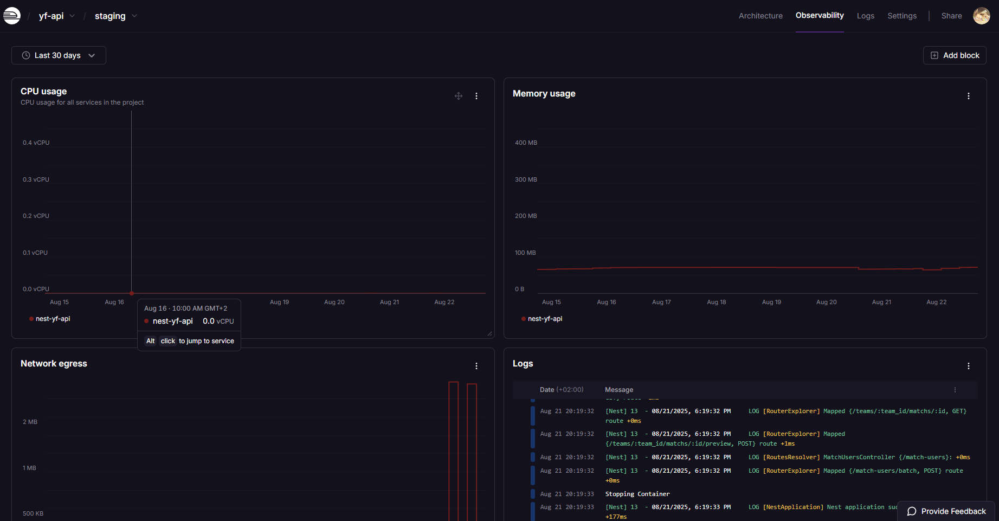
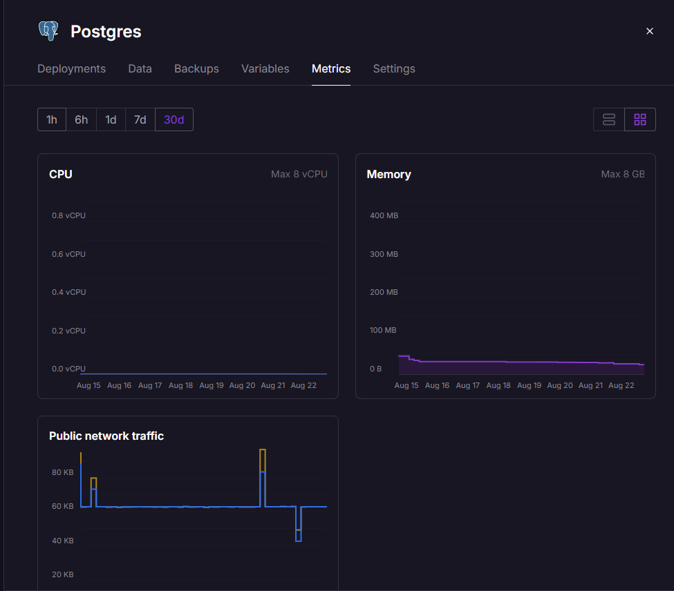
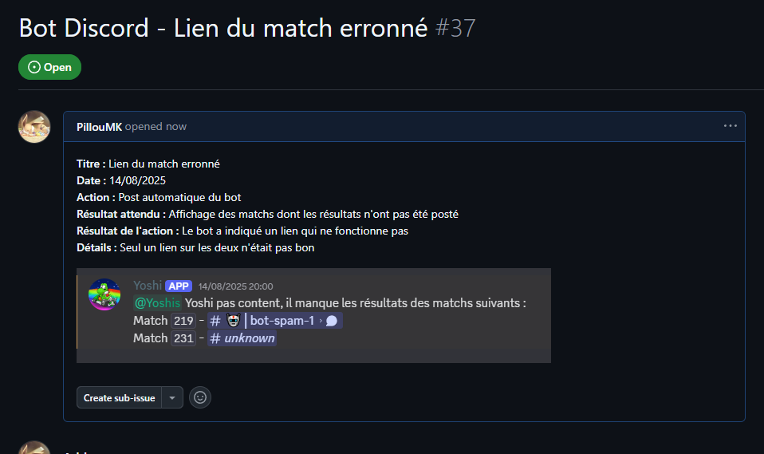
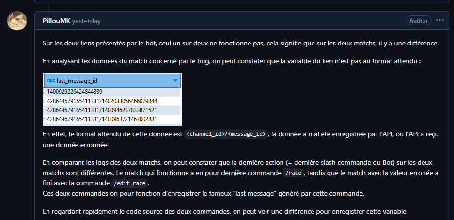
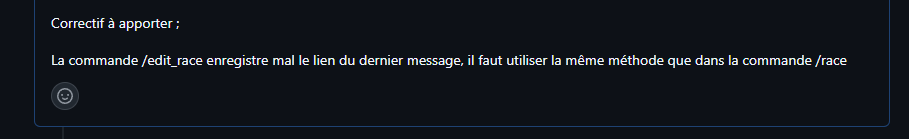

# 1. Présentaion du projet

## 1.1 Contexte

Ce projet consiste en la conception et le développement d’une application à destination des équipes compétitives du jeu vidéo **Mario Kart**.  
L’application a pour objectif l’automatisation de nombreuses tâches jusqu’ici manuelles tout en valorisant les données collectées grâce à leur analyse et à la production de **statistiques avancées**, permettant ainsi d’optimiser les performances et la prise de décision des équipes.

L’application est séparée en deux entités :

- **Front-end** : un **Bot Discord** permettant aux équipes de saisir et consulter les résultats directement depuis leur serveur Discord.
- **Back-end** : une **API REST** connectée à une base de données **PostgreSQL**, chargée de centraliser, traiter et fournir les données.

# 2. Monitoring de l'application

## 2.1 Gestion des dépendances logicielles - C4.1.1

Les deux projets (l'API Rest et le Bot Discord) sont des projets utilisant l'environnement de Node.js, qui utilise le gestionnaire de package `npm`. Les dépendances du projet sont listées dans le fichier package.json.
Pour garantir la sécurité et la stabilité de l’application, un processus de mise à jour des dépendances est mis en place.

### Audit des dépendances

Dans la pipeline CI/CD des projets, le workflow executé par Github Action va réaliser un audit des dépendances avec `npm audit`. En ajoutant le paramètre `--audit-level`, on peut rendre cet audit "bloquant". En effet, si une vulnérabilité du niveau choisi est trouvé, cela fera échouer le workflow.

**Exemple pour l'API Rest :**
Voici le workflow executé lors du merge vers la branche staging

```yml
name: Staging CI

on:
  push:
    branches:
      - staging

jobs:
  ci:
    runs-on: ubuntu-latest

    steps:
      [...]

      - name: Run audit
        run: npm audit --audit-level=high

      - name: Build
        run: npm run build

      - name: Run ESLint
        run: npm run lint
```

`npm audit --audit-level=high` va faire échouer le workflow, cela aura pour conséquence le non-déploiement du projet sur Railway, en effet celui-ci ne déploie le projet que si le workflow a réussi.
Cette sécurité empêche de déployer une version de l'application possèdant des vulnérabilités au niveau des dépendances

Si une telle vulnérabilité venait à être trouvée, il est possible d'executer la commande `npm audit fix`

### Github dependabot

Github intègre un bot qui permet de surveiller les dépendances d'un projet, et de proposer des Pull Request si une mise à jour a été trouvé. Egalement, il créé des Security Alert lorsqu'une faille de sécurité a été détectée, prévenant ainsi par mail.

Afin d'augmenter la sécurisation du projet, nous avons activé ces fonctionnalités pour ce projet :


### Conclusion

Ces sécurités mises en places garantissent que le projet ne pourra être déployée avec de telles vulnérabilité. Les alertes mises en place avec dependabot permettront de rapidement réagir afin d'éviter qu'une dette technique se mette en place

## 2.2 Système de supervision - C4.1.2

Railway propose des outils directement intégrés pour permettre une surveillance de l'état de santé de l'application, nous utilisons certains de ces outils pour avoir en permanence une idée du statut du logiciel

### Sondes mises en place

#### API Rest

- Logs de l'application
- Metrics en direct : CPU Usage, Memory Usage, Network egress



Ces informations permettent de connaître l'état du serveur, afin de savoir s'il tourne et s'il est dans un état critique ou non

- Logs des requêtes HTTPS à l'API


Permet de voir si les requêtes faites à l'API aboutissent bien ainsi que leur temps de réponse

#### Base de données

Comme c'est également Railway qui héberge la base de données, les mêmes sondes ont été mises en place



#### Bot Discord

Le bot possède les mêmes metrics que montré précédement, cependant il n'a pas de logs HTTPS

#### Critères de performances

Disponibilités des services > 99%, donc accessibles en continu

API :

- Temps de réponse rapide : < 200ms en moyenne

Bot Discord :

- Temps de réponse rapide : < 200ms sur les commandes les plus utilisés

Cependant Railway ne permet pas de configurer des seuils d'alertes pour automatiser le signalement, cette supervison est donc bien structuré mais reste manuel et nécessite d'être rigoureux.
Mais si l'application venait a crash, Railway s'occupe de lui-même de la remettre en ligne

# 3. Traitement des anomalies

## 3.1 Consignation des anomalies - C4.2.1

#### Processus de collecte des anomalies

Deux processus de collecte des anomalies ont été mis en place, ces deux processus sont manuels

1. Utilisations des logs de l'application

Le premier processus s'appuie sur les logs de l'application. Avec Railway, nous avons différent type de log que nous pouvons surveiller :

- Logs HTTPS, pas forcément le plus pertinent, mais permet de détecter rapidement les erreurs 500


- Logs de l'application, pour surveiller les potentielles erreurs, il est possible de filtrer ces logs afin de directement chercher les erreurs, par exemple avec le mot-clé "error"


Cette collecte n'est pas automatisé, mais elle est structuré de manière à être efficace si elle est effectuée de manière régulière et rigoureuse.

2. Signalement des utilisateurs

Un canal de discussion a été mis en place pour que les utilisateurs puisse signaler les erreurs et/ou bugs, à l'aide d'un template ils peuvent signaler de manière efficace les problèmes

template :

```
Titre :
Date :
Action :
Résultat attendu :
Résultat de l'action :
Détails :
```

Lorsqu'une anomalie est détectée, une issue est créé sur Github et un développeur est assigné à celle-ci
<br>Une branche est créé à l'occasion : `fix/bug-example`

#### Exemple de la consignation d'une anomalie rencontrée au cours du projet :

- Détectée par un utilisateur, celui-ci va créer un ticket dans le channel prévu à cet effet, en utilisant le template :
  

- Le développeur va, à partir du signalement, créer une issue sur le repo Github :
  

  Et ajouter l'analyse du bug pour permettre au développeur qui s'occupera du problème de corriger l'anomalie :

  

## 3.2 - Correction des anomalies - C4.2.2

Pour corriger l'anomalie, nous créons la branche : `fix/match-last-message-id`

En se basant sur l'analyse qui a été détaillé sur le ticket, on corrige la source du problème :

```ts
try {
  const msg = await interaction.reply(newRace);

  -- war.paramWar.last_message_id = `${msg.id}`;
  ++ war.paramWar.last_message_id = BuildMessageLink(interaction.channelId, msg.id)
  saveJSONToFile(botwar, botwarPath);
  } catch (e: any) {
    console.log(e.requestBody.requestBody);
}
```

Une fois le bug corrigé et testé en local, on merge la branche du correctif dans `dev` et on laisse la pipeline s'executer. Les tests unitaires lors de la pipeline permettent de s'assurer la non-regression apporté par ce patch

le commit doit suivre la nomenclature suivante :
`fix: xxx (fixed #ID)`, avec ID le numéro du ticket

Avant de déployer le fix en production, on passe par la branche `staging` qui permet de tester dans un environnement en "conditions réelles". Puis le correctif est déployé en production lors du merge de `staging` vers `main`

Semantic-release va permettre la montée de version du projet, et le mot-clé "fixed #ID" va automatiquement fermer l'issue sur Github


# 4. Assurer la maintenance du logiciel

## 4.1 Axes d'améliorations - C4.3.1

Il existe diférents axes d'améliorations qui sont explorables pour ce projet : l'expérience utilisateur, les performances et l'ergonomie de l'application etc.<br>
Du côté de l'expérience utilisateur, c'est principalement le Bot Discord qui est concerné, puisque c'est lui qui intéragi avec les utilisateurs, c'est le front-end.

#### Axes d'amélioration de l'UX

- **Multi-langages :** Aujourd'hui le Bot Discord est mono-langage, sauf que Discord.JS donne la possibilité de connaître la langue de l'utilisateur utilisant une commande. Ainsi il serait possible d'adapter les textes des commandes et réponses du bot pour chaque utilisateur.

  - Amélioration de l'attractivité du Bot, l'ouvrant à un public plus large
  - Coût d'amélioration assez faible, c'est déjà géré en partie par Discord, l'utilisation de fichiers de traduction suffiraient à rapidement mettre cette fonctionnalité en place

- **Système de rappel sur les disponibilités** : Le système de gestion des disponiblités sert aux équipes à connaîtres les disponibilités des joueurs pour le jour-même. Cependant parfois les joueurs peuvent oublier de remplir ces informations ou bien il peut manquer un joueur pour un match, obligeant les joueurs à courrir après leurs coéquipiers pour trouver un joueur disponibles

  - Un système de rappel permettrait d'améliorer la pertinence de la fonctionnalité
  - Cout d'amélioration moyen, il n'y a pas de fonctionnalité à retravailler en profondeur risquant de créer une regression, mais il faudrait tout de même mettre en place ce système de rappel de zéro

- **Historique des disponibilités** : Aujourd'hui, les disponiblités sont supprimés chaque jour, il n'y a aucun historique
  - Possibilités pour les équipes de connaître précisement l'activité de ses joueurs, même s'ils n'ont pas forccément joués.
  - Coût élevé en terme de ressources et de temps, la fonctionnalité aujourd'hui ne gère absolument pas cela et tout devrait être repensé de presque zéro.

## 4.2 Traçabilité des actions de maintenance et d'évolution - C4.3.2

L'utilisation de `semantic-release` permet de tenir un historique de version de manière automatique. A cela s'ajoute un journal de version tenu automatiquement, se basant sur les commits du projet.

Il est possible de modifier ce journal de version pour pouvoir y apporter des précisions sur les modifications (par exemple dans le cas où le commit n'est pas clair)

Ce système nécessite d'être rigoureux sur les commits du projet. Ou bien de repasser sur le journal de version pour y apporter les détails manuellement.

#### Journal de version de l'API Rest :


## 4.3 Collaboration avec le support client - C4.3.3

Pour l'exemple de collaboration avec le support client, nous pouvons reprendre l'anomalie de la compétence C4.2.2 où c'est le support client qui a remonté l'anomalie en transmettant le ticket reçu dans le canal de discussion prévu à cet effet.

### Contexte retour client

Un ticket est reçu par le support client suite à un bug trouvé par un utilisateur


Le support va alors créer une issue sur Github à partir de ce ticket, pour le développeur



### Analyse du ticket par le développeur

Le bug est analysé afin de trouver la source du problème : Un lien du message généré par le bot ne renvoit vers aucun message<br>
Il est trouvé que la façons dont est enregistré le lien du message a été mal conçu sur la commande `/edit_race`


### Résolution technique

Le développeur indique dans l'issue Github la solution technique à apporter pour résoudre l'anomalie



### Les parties prenante

- L'utilisateur
  - Signale un bug qu'il a rencontré lors de l'utilisation du Bot Discord, pour cela il créé un ticket.
- Le support client
  - Transmet le ticket créé par l'utilisateur au développeur en créant une issue Github.
  - Indique à l'utilisateur que le bug est pris en charge/a été résolu.
- Le développeur
  - Analyse le bug et le corrige, déploie le correctif.
  - Indique au support client lorsque un correctif est déployé.
